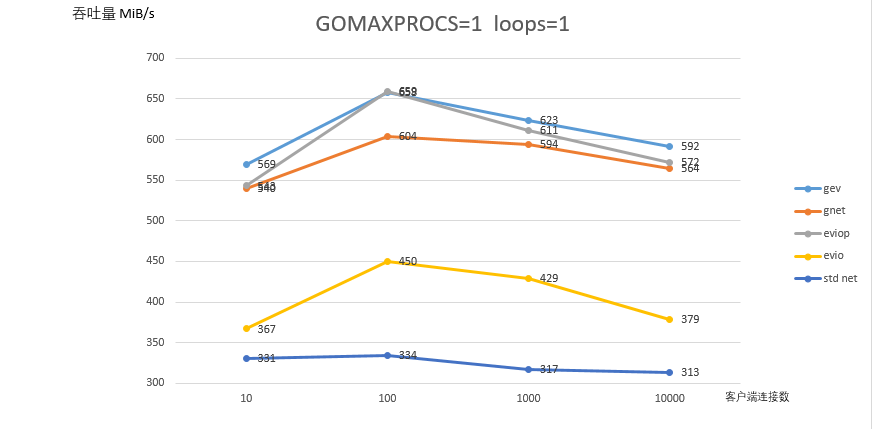
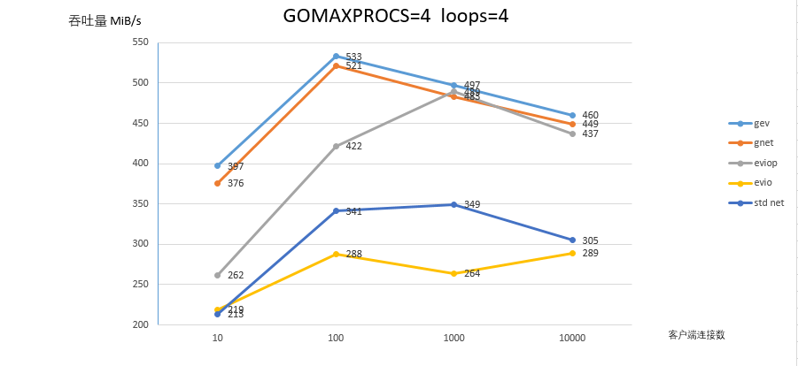
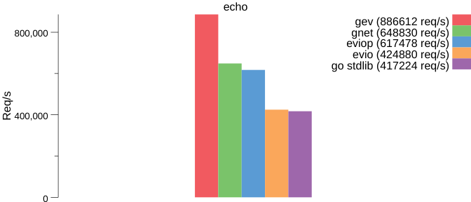
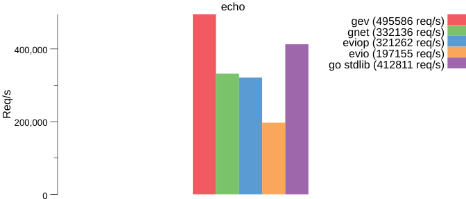
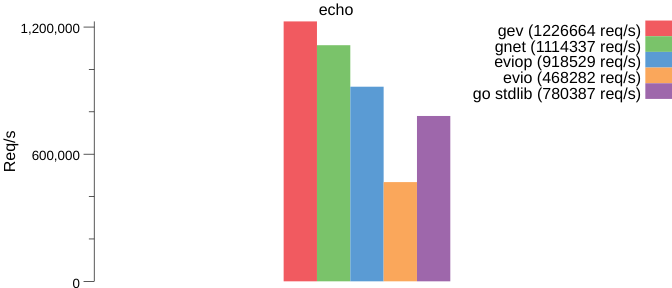
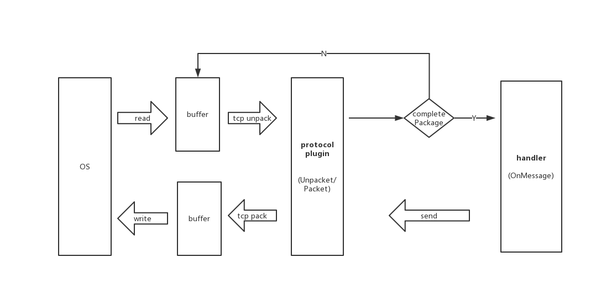

# gev

[](https://github.com/Allenxuxu/gev/actions)
[](https://goreportcard.com/report/github.com/Allenxuxu/gev)
[](https://www.codacy.com/manual/Allenxuxu/gev?utm_source=github.com&amp;utm_medium=referral&amp;utm_content=Allenxuxu/gev&amp;utm_campaign=Badge_Grade)
[](https://godoc.org/github.com/Allenxuxu/gev)
[](https://github.com/Allenxuxu/gev/blob/master/LICENSE)
[](https://img.shields.io/github/languages/code-size/Allenxuxu/gev.svg?style=flat)

#### 中文 | [English](README.md)

`gev` 是一个轻量、快速的基于 Reactor 模式的非阻塞 TCP 网络库，支持自定义协议，轻松快速搭建高性能服务器。

## 特点

- 基于 epoll 和 kqueue 实现的高性能事件循环
- 支持多核多线程
- 动态扩容 Ring Buffer 实现的读写缓冲区
- 异步读写
- 自动清理空闲连接
- SO_REUSEPORT 端口重用支持
- 支持 WebSocket/Protobuf
- 支持定时任务，延时任务
- 支持自定义协议

## 网络模型

`gev` 只使用极少的 goroutine, 一个 goroutine 负责监听客户端连接，其他 goroutine （work 协程）负责处理已连接客户端的读写事件，work 协程数量可以配置，默认与运行主机 CPU 数量相同。

<div align=center>

</div>

## 性能测试

<details>
  <summary> 📈 测试数据 </summary>

> 测试环境 Ubuntu18.04 | 4 Virtual CPUs | 4.0 GiB

### 吞吐量测试

限制 GOMAXPROCS=1（单线程），1 个 work 协程



限制 GOMAXPROCS=4，4 个 work 协程



### 其他测试

<details>
  <summary> 速度测试 </summary>

和同类库的简单性能比较, 压测方式与 evio 项目相同。

- gnet
- eviop
- evio
- net (标准库)

限制 GOMAXPROCS=1，1 个 work 协程



限制 GOMAXPROCS=1，4 个 work 协程



限制 GOMAXPROCS=4，4 个 work 协程



</details>

</details>

## 安装

```bash
go get -u github.com/Allenxuxu/gev
```

## 快速入门

### echo demo

```go
package main

import (
	"flag"
	"strconv"

	"github.com/Allenxuxu/gev"
	"github.com/Allenxuxu/gev/connection"
)

type example struct{}

func (s *example) OnConnect(c *connection.Connection) {
	//log.Println(" OnConnect ： ", c.PeerAddr())
}
func (s *example) OnMessage(c *connection.Connection, ctx interface{}, data []byte) (out []byte) {
	//log.Println("OnMessage")
	out = data
	return
}

func (s *example) OnClose(c *connection.Connection) {
	//log.Println("OnClose")
}

func main() {
	handler := new(example)
	var port int
	var loops int

	flag.IntVar(&port, "port", 1833, "server port")
	flag.IntVar(&loops, "loops", -1, "num loops")
	flag.Parse()

	s, err := gev.NewServer(handler,
		gev.Address(":"+strconv.Itoa(port)),
		gev.NumLoops(loops))
	if err != nil {
		panic(err)
	}

	s.Start()
}
```

Handler 是一个接口，我们的程序必须实现它。

```go
type Handler interface {
	OnConnect(c *connection.Connection)
	OnMessage(c *connection.Connection, ctx interface{}, data []byte) []byte
	OnClose(c *connection.Connection)
}

func NewServer(handler Handler, opts ...Option) (server *Server, err error)
```

OnMessage 会在一个完整的数据帧到来时被回调。用户可此可以拿到数据，处理业务逻辑，并返回需要发送的数据。

在有数据到来时，gev 并非立刻回调 OnMessage ，而是会先回调一个 UnPacket 函数。大概执行逻辑如下：

```go
ctx, receivedData := c.protocol.UnPacket(c, buffer)
if ctx != nil || len(receivedData) != 0 {
	sendData := c.OnMessage(c, ctx, receivedData)
	if len(sendData) > 0 {
		return c.protocol.Packet(c, sendData)
	}
}
```



UnPacket 函数中会查看 ringbuffer 中的数据是否是一个完整的数据帧，如果是则会将数据拆包并返回 payload 数据；如果还不是一个完整的数据帧，则直接返回。

UnPacket 的返回值 `(interface{}, []byte)` 会作为 OnMessage 的入参 `ctx interface{}, data []byte` 被传入并回调。`ctx` 被设计用来传递在 UnPacket 函数中解析数据帧时生成的特殊信息（复杂的数据帧协议会需要），`data` 则是用来传递 payload 数据。

```go
type Protocol interface {
	UnPacket(c *Connection, buffer *ringbuffer.RingBuffer) (interface{}, []byte)
	Packet(c *Connection, data []byte) []byte
}

type DefaultProtocol struct{}

func (d *DefaultProtocol) UnPacket(c *Connection, buffer *ringbuffer.RingBuffer) (interface{}, []byte) {
	ret := buffer.Bytes()
	buffer.RetrieveAll()
	return nil, ret
}

func (d *DefaultProtocol) Packet(c *Connection, data []byte) []byte {
	return data
}
```

如上，`gev` 提供一个默认的 Protocol 实现，会将接受缓冲区中( ringbuffer )的所有数据取出。
在实际使用中，通常会有自己的数据帧协议，`gev` 可以以插件的形式来设置：在创建 Server 的时候通过可变参数设置。

```go
s, err := gev.NewServer(handler,gev.Protocol(&ExampleProtocol{}))
```

更详细的使用方式可以参考示例：[自定义协议](example/protocol)

Connection 还提供 Send 方法来发送数据。Send 并不会立刻发送数据，而是先添加到 event loop 的任务队列中，然后唤醒 event loop 去发送。

更详细的使用方式可以参考示例：[服务端定时推送](example/pushmessage/main.go)

```go
func (c *Connection) Send(buffer []byte) error
```

Connection ShutdownWrite 会关闭写端，从而断开连接。

更详细的使用方式可以参考示例：[限制最大连接数](example/maxconnection/main.go)

```go
func (c *Connection) ShutdownWrite() error
```

[RingBuffer](https://github.com/Allenxuxu/ringbuffer) 是一个动态扩容的循环缓冲区实现。

### WebSocket 支持

WebSocket 协议构建在 TCP 协议之上的，所以 `gev` 无需内置它，而是通过插件的形式提供支持，在 `plugins/websocket` 目录。

<details>
  <summary> code </summary>

```go
type Protocol struct {
	upgrade *ws.Upgrader
}

func New(u *ws.Upgrader) *Protocol {
	return &Protocol{upgrade: u}
}

func (p *Protocol) UnPacket(c *connection.Connection, buffer *ringbuffer.RingBuffer) (ctx interface{}, out []byte) {
	upgraded := c.Context()
	if upgraded == nil {
		var err error
		out, _, err = p.upgrade.Upgrade(buffer)
		if err != nil {
			log.Println("Websocket Upgrade :", err)
			return
		}
		c.SetContext(true)
	} else {
		header, err := ws.VirtualReadHeader(buffer)
		if err != nil {
			log.Println(err)
			return
		}
		if buffer.VirtualLength() >= int(header.Length) {
			buffer.VirtualFlush()

			payload := make([]byte, int(header.Length))
			_, _ = buffer.Read(payload)

			if header.Masked {
				ws.Cipher(payload, header.Mask, 0)
			}

			ctx = &header
			out = payload
		} else {
			buffer.VirtualRevert()
		}
	}
	return
}

func (p *Protocol) Packet(c *connection.Connection, data []byte) []byte {
	return data
}
```

</details>

详细实现可以插件实现查看 [源码](plugins/websocket)，使用方式可以查看 websocket [示例](example/websocket)

## 示例

<details>
  <summary> echo server</summary>

```go
package main

import (
	"flag"
	"strconv"

	"github.com/Allenxuxu/gev"
	"github.com/Allenxuxu/gev/connection"
)

type example struct{}

func (s *example) OnConnect(c *connection.Connection) {
	//log.Println(" OnConnect ： ", c.PeerAddr())
}
func (s *example) OnMessage(c *connection.Connection, ctx interface{}, data []byte) (out []byte) {
	//log.Println("OnMessage")
	out = data
	return
}

func (s *example) OnClose(c *connection.Connection) {
	//log.Println("OnClose")
}

func main() {
	handler := new(example)
	var port int
	var loops int

	flag.IntVar(&port, "port", 1833, "server port")
	flag.IntVar(&loops, "loops", -1, "num loops")
	flag.Parse()

	s, err := gev.NewServer(handler,
		gev.Network("tcp"),
		gev.Address(":"+strconv.Itoa(port)),
		gev.NumLoops(loops))
	if err != nil {
		panic(err)
	}

	s.Start()
}
```

</details>

<details>
  <summary> 主动断开空闲连接 </summary>

```go
package main

import (
	"flag"
	"strconv"
	"time"

	"github.com/Allenxuxu/gev"
	"github.com/Allenxuxu/gev/connection"
	"github.com/Allenxuxu/gev/log"
)

type example struct {
}

func (s *example) OnConnect(c *connection.Connection) {
	log.Info(" OnConnect ： ", c.PeerAddr())
}
func (s *example) OnMessage(c *connection.Connection, ctx interface{}, data []byte) (out []byte) {
	log.Infof("OnMessage from : %s", c.PeerAddr())
	out = data
	return
}

func (s *example) OnClose(c *connection.Connection) {
	log.Info("OnClose: ", c.PeerAddr())
}

func main() {
	handler := new(example)
	var port int
	var loops int

	flag.IntVar(&port, "port", 1833, "server port")
	flag.IntVar(&loops, "loops", -1, "num loops")
	flag.Parse()

	s, err := gev.NewServer(handler,
		gev.Network("tcp"),
		gev.Address(":"+strconv.Itoa(port)),
		gev.NumLoops(loops),
		gev.IdleTime(5*time.Second))
	if err != nil {
		panic(err)
	}

	s.Start()
}
```

</details>

<details>
  <summary> 限制最大连接数 </summary>

```go
package main

import (
	"log"

	"github.com/Allenxuxu/gev"
	"github.com/Allenxuxu/gev/connection"
	"github.com/Allenxuxu/toolkit/sync/atomic"
)

// Server example
type Server struct {
	clientNum     atomic.Int64
	maxConnection int64
	server        *gev.Server
}

// New server
func New(ip, port string, maxConnection int64) (*Server, error) {
	var err error
	s := new(Server)
	s.maxConnection = maxConnection
	s.server, err = gev.NewServer(s,
		gev.Address(ip+":"+port))
	if err != nil {
		return nil, err
	}

	return s, nil
}

// Start server
func (s *Server) Start() {
	s.server.Start()
}

// Stop server
func (s *Server) Stop() {
	s.server.Stop()
}

// OnConnect callback
func (s *Server) OnConnect(c *connection.Connection) {
	s.clientNum.Add(1)
	log.Println(" OnConnect ： ", c.PeerAddr())

	if s.clientNum.Get() > s.maxConnection {
		_ = c.ShutdownWrite()
		log.Println("Refused connection")
		return
	}
}

// OnMessage callback
func (s *Server) OnMessage(c *connection.Connection, ctx interface{}, data []byte) (out []byte) {
	log.Println("OnMessage")
	out = data
	return
}

// OnClose callback
func (s *Server) OnClose(c *connection.Connection) {
	s.clientNum.Add(-1)
	log.Println("OnClose")
}

func main() {
	s, err := New("", "1833", 1)
	if err != nil {
		panic(err)
	}
	defer s.Stop()

	s.Start()
}
```

</details>

<details>
  <summary> 服务端定时推送 </summary>

```go
package main

import (
	"container/list"
	"github.com/Allenxuxu/gev"
	"github.com/Allenxuxu/gev/connection"
	"log"
	"sync"
	"time"
)

// Server example
type Server struct {
	conn   *list.List
	mu     sync.RWMutex
	server *gev.Server
}

// New server
func New(ip, port string) (*Server, error) {
	var err error
	s := new(Server)
	s.conn = list.New()
	s.server, err = gev.NewServer(s,
		gev.Address(ip+":"+port))
	if err != nil {
		return nil, err
	}

	return s, nil
}

// Start server
func (s *Server) Start() {
	s.server.RunEvery(1*time.Second, s.RunPush)
	s.server.Start()
}

// Stop server
func (s *Server) Stop() {
	s.server.Stop()
}

// RunPush push message
func (s *Server) RunPush() {
	var next *list.Element

	s.mu.RLock()
	defer s.mu.RUnlock()

	for e := s.conn.Front(); e != nil; e = next {
		next = e.Next()

		c := e.Value.(*connection.Connection)
		_ = c.Send([]byte("hello\n"))
	}
}

// OnConnect callback
func (s *Server) OnConnect(c *connection.Connection) {
	log.Println(" OnConnect ： ", c.PeerAddr())

	s.mu.Lock()
	e := s.conn.PushBack(c)
	s.mu.Unlock()
	c.SetContext(e)
}

// OnMessage callback
func (s *Server) OnMessage(c *connection.Connection, ctx interface{}, data []byte) (out []byte) {
	log.Println("OnMessage")
	out = data
	return
}

// OnClose callback
func (s *Server) OnClose(c *connection.Connection) {
	log.Println("OnClose")
	e := c.Context().(*list.Element)

	s.mu.Lock()
	s.conn.Remove(e)
	s.mu.Unlock()
}

func main() {
	s, err := New("", "1833")
	if err != nil {
		panic(err)
	}
	defer s.Stop()

	s.Start()
}
```

</details>

<details>
  <summary> WebSocket </summary>

```go
package main

import (
	"flag"
	"log"
	"math/rand"
	"strconv"

	"github.com/Allenxuxu/gev"
	"github.com/Allenxuxu/gev/connection"
	"github.com/Allenxuxu/gev/plugins/websocket/ws"
	"github.com/Allenxuxu/gev/plugins/websocket/ws/util"
)

type example struct{}

func (s *example) OnConnect(c *connection.Connection) {
	log.Println(" OnConnect ： ", c.PeerAddr())
}
func (s *example) OnMessage(c *connection.Connection, data []byte) (messageType ws.MessageType, out []byte) {
	log.Println("OnMessage:", string(data))
	messageType = ws.MessageBinary
	switch rand.Int() % 3 {
	case 0:
		out = data
	case 1:
		msg, err := util.PackData(ws.MessageText, data)
		if err != nil {
			panic(err)
		}
		if err := c.Send(msg); err != nil {
			msg, err := util.PackCloseData(err.Error())
			if err != nil {
				panic(err)
			}
			if e := c.Send(msg); e != nil {
				panic(e)
			}
		}
	case 2:
		msg, err := util.PackCloseData("close")
		if err != nil {
			panic(err)
		}
		if e := c.Send(msg); e != nil {
			panic(e)
		}
	}
	return
}

func (s *example) OnClose(c *connection.Connection) {
	log.Println("OnClose")
}

func main() {
	handler := new(example)
	var port int
	var loops int

	flag.IntVar(&port, "port", 1833, "server port")
	flag.IntVar(&loops, "loops", -1, "num loops")
	flag.Parse()

	s, err := NewWebSocketServer(handler, &ws.Upgrader{},
		gev.Network("tcp"),
		gev.Address(":"+strconv.Itoa(port)),
		gev.NumLoops(loops))
	if err != nil {
		panic(err)
	}

	s.Start()
}
```

```go
package main

import (
	"github.com/Allenxuxu/gev"
	"github.com/Allenxuxu/gev/plugins/websocket"
	"github.com/Allenxuxu/gev/plugins/websocket/ws"
)

// NewWebSocketServer 创建 WebSocket Server
func NewWebSocketServer(handler websocket.WebSocketHandler, u *ws.Upgrader, opts ...gev.Option) (server *gev.Server, err error) {
	opts = append(opts, gev.Protocol(websocket.New(u)))
	return gev.NewServer(websocket.NewHandlerWrap(u, handler), opts...)
}
```

</details>

<details>
  <summary> protobuf </summary>

```go
package main

import (
	"flag"
	"log"
	"strconv"

	"github.com/Allenxuxu/gev"
	"github.com/Allenxuxu/gev/connection"
	pb "github.com/Allenxuxu/gev/example/protobuf/proto"
	"github.com/Allenxuxu/gev/plugins/protobuf"
	"github.com/golang/protobuf/proto"
)

type example struct{}

func (s *example) OnConnect(c *connection.Connection) {
	log.Println(" OnConnect ： ", c.PeerAddr())
}
func (s *example) OnMessage(c *connection.Connection, ctx interface{}, data []byte) (out []byte) {
	msgType := ctx.(string)

	switch msgType {
	case "msg1":
		msg := &pb.Msg1{}
		if err := proto.Unmarshal(data, msg); err != nil {
			log.Println(err)
		}
		log.Println(msgType, msg)
	case "msg2":
		msg := &pb.Msg2{}
		if err := proto.Unmarshal(data, msg); err != nil {
			log.Println(err)
		}
		log.Println(msgType, msg)
	default:
		log.Println("unknown msg type")
	}

	return
}

func (s *example) OnClose(c *connection.Connection) {
	log.Println("OnClose")
}

func main() {
	handler := new(example)
	var port int
	var loops int

	flag.IntVar(&port, "port", 1833, "server port")
	flag.IntVar(&loops, "loops", -1, "num loops")
	flag.Parse()

	s, err := gev.NewServer(handler,
		gev.Network("tcp"),
		gev.Address(":"+strconv.Itoa(port)),
		gev.NumLoops(loops),
		gev.Protocol(&protobuf.Protocol{}))
	if err != nil {
		panic(err)
	}

	log.Println("server start")
	s.Start()
}
```

```go
package main

import (
	"bufio"
	"fmt"
	"log"
	"math/rand"
	"net"
	"os"

	pb "github.com/Allenxuxu/gev/example/protobuf/proto"
	"github.com/Allenxuxu/gev/plugins/protobuf"
	"github.com/golang/protobuf/proto"
)

func main() {
	conn, e := net.Dial("tcp", ":1833")
	if e != nil {
		log.Fatal(e)
	}
	defer conn.Close()

	var buffer []byte
	for {
		reader := bufio.NewReader(os.Stdin)
		fmt.Print("Text to send: ")
		text, _ := reader.ReadString('\n')
		name := text[:len(text)-1]

		switch rand.Int() % 2 {
		case 0:
			msg := &pb.Msg1{
				Name: name,
				Id:   1,
			}

			data, err := proto.Marshal(msg)
			if err != nil {
				panic(err)
			}
			buffer = protobuf.PackMessage("msg1", data)
		case 1:
			msg := &pb.Msg2{
				Name:  name,
				Alias: "big " + name,
				Id:    2,
			}

			data, err := proto.Marshal(msg)
			if err != nil {
				panic(err)
			}
			buffer = protobuf.PackMessage("msg2", data)
		}

		_, err := conn.Write(buffer)
		if err != nil {
			panic(err)
		}
	}
}
```

</details>

## 致谢

感谢 JetBrains 提供的免费开源 License

<a href="https://www.jetbrains.com/?from=gev" target="_blank">
	
</a>

## 参考

本项目受 evio 启发，参考 muduo 实现。

- [evio](https://github.com/tidwall/evio)
- [muduo](https://github.com/chenshuo/muduo)
